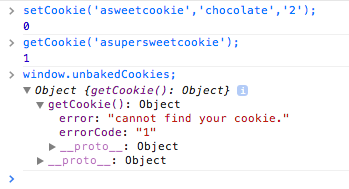

# Cookies
## What is Cookies.js?
A lightweight vanilla JavaScript plugin to set, get and remove cookies (i.eg., cross-browser). 

#### How Cookies Works
Cookies.js is dependency free plugin that remembers information about a user.  When a user visits a web page, Cookies.js can store data about that user.

#### Set Cookie
You can set yourself a cookie with setCookie(). You will need to provide the following arguments:

```bash
	setCookie(
	  'asweetcookie', # cname - name of the cookie  
	  'chocolate',    # cvalue - the value of the cookie
	  '2'             # exdays - expiration date in days 
	);
	
```

#### Get Cookie
You can get a cookie with getCookie(). You will need to provide the following arguments to get your cookie:

```bash
	// Get a cookie with arguments
	getCookie(
	  'asweetcookie', # cname - name of the cookie  
	);
```

#### Remove Cookie

You can remove a cookie with removeCookie(). You will need to provide the following arguments:

```bash
	// Remove a cookie with arguments
	removeCookie(
      'asweetcookie', # cname - name of the cookie  
	);
```

#### Error Handling
At any point in time if you call a function and receive a non-zero return, you have yourself an error (sad day). If you'd like to learn more about the error, take a look at window.unbakedCookies in the console. This variable is a neat little object to tell you what has gone wrong. It provides the function name where the error occurred (a human readable error message) and a numerical error message.



#### Parameters

| Parameter        | Default           | Definition  |
| :-------------: |:-------------:| :-----:|
| cname  | null | name of the cookie |
| cvalue | null | value of the cookie  |
| exdays | null | number of days until expiration or 'session' to set in-memory / transient cookie   |
